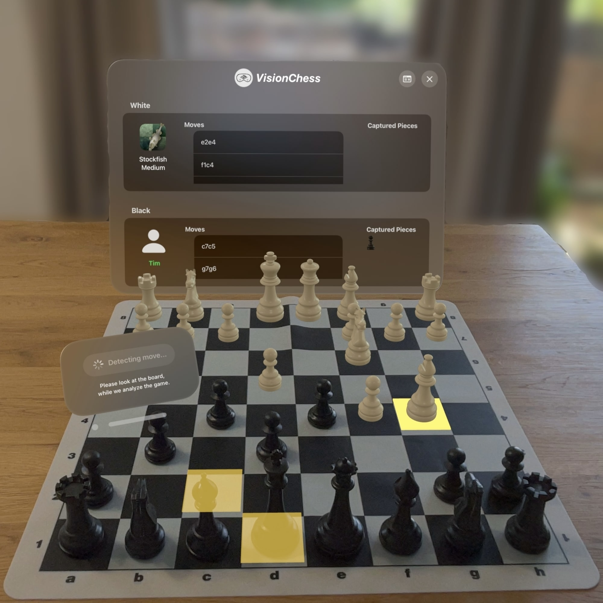
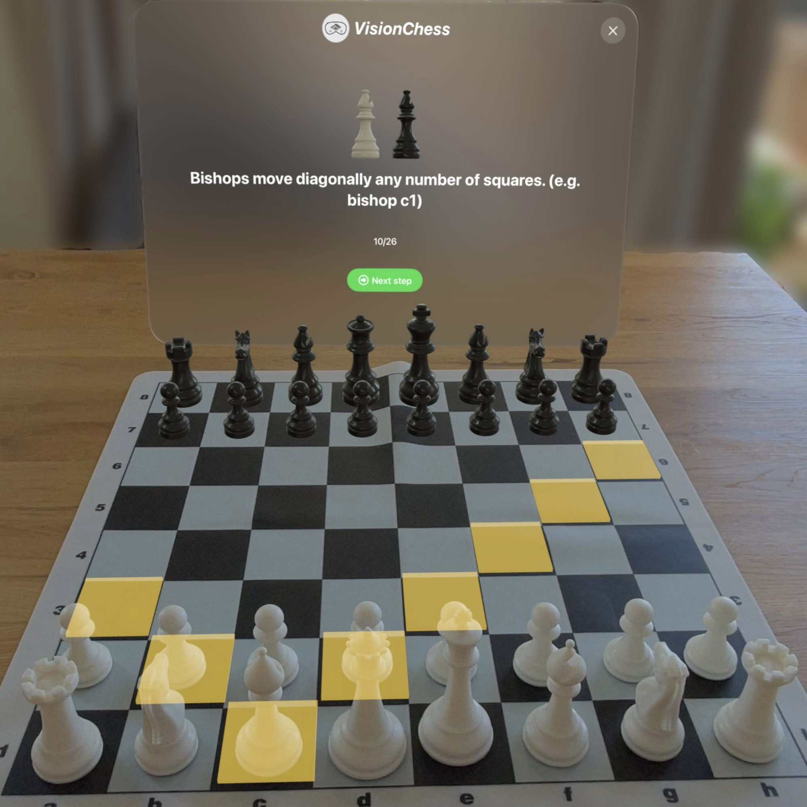

# VisionChess

**VisionChess** is a Mixed Reality chess system for the Apple Vision Pro that connects physical chess gameplay with real-time computer vision and chess-engine assistance.

The system observes a real chessboard through the Apple Vision Pro, reconstructs the current board state, sends the position to a backend for validation and analysis, and visualizes the results as spatially aligned Mixed Reality overlays directly on the physical board.

<table>
  <tr>
    <td align="center">
      
      <br/>
      <sub>Move Suggestion</sub>
    </td>
    <td align="center">
      
      <br/>
      <sub>Move Detection</sub>
    </td>
    <td align="center">
      
      <br/>
      <sub>Check Highlighting</sub>
    </td>
    <td align="center">
      
      <br/>
      <sub>Tutorial</sub>
    </td>
  </tr>
</table>

---

## Overview

VisionChess enhances real-world chess by combining the tactile interaction of a physical board with digital strategic support. Instead of replacing the board with a purely virtual interface, VisionChess preserves the physical chess experience and adds contextual Mixed Reality feedback such as move suggestions, check highlighting, and tutorial assistance.

The project consists of two main components:

1. **VisionChess-App** — the visionOS client for Apple Vision Pro.
2. **VisionChess-Server** — the backend server for move validation, game persistence, and Stockfish-based analysis.

Detailed subproject documentation is available here:

- [VisionChess-App README](https://github.com/dbisUnibas/VisionChess/blob/main/VisionChess-App/README.md)
- [VisionChess-Server README](https://github.com/dbisUnibas/VisionChess/blob/main/VisionChess-Server/README.md)

---
## Requirements

### Client Requirements

- Apple Vision Pro
- Enterprise Entitlement for camera access
- macOS development machine
- Xcode with visionOS support
- VisionChess-App project
- CoreML-compatible chessboard and piece-detection models
- Network access to the backend server


### Server Requirements

- Kotlin/JVM backend environment
- MongoDB
- Stockfish chess engine
- Network access from the Apple Vision Pro client


## Citation

If you use VisionChess in academic work, please cite the corresponding publication:

```bibtex
@inproceedings{visionchess,
  title     = {VisionChess: A Mixed Reality System for Real-Time Chess Assistance Using Computer Vision},
  author    = {Arnold, Rahel and Bachmann, Tim and Schuldt, Heiko},
  booktitle = {IEEE International Conference on Multimedia and Expo},
  year      = {2026}
}
